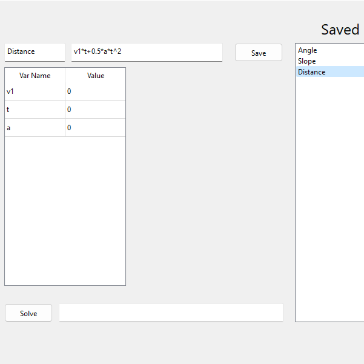

<html lang="en">
    <body>
        <!---->
        <h3>📖Personal</h3>
        
Hey, I'm Peyton Crua, a Computer Science major at the University of Utah. Currently I'm into game development and software development.

        <!---->
        <h3>💻Current Projects</h3>
        <ul>
            <li>Floatr, an application dedicated to saving and solving equations, removing the need to re-look up the same equation</li>
            <li>A game inspried by Cobalt Core in Unity</li>
            <li>A DND helper application to help handle the tons of information needed during a campaign</li>
        </ul>
        <!---->
        <h3>🕒Future Plans</h3>
        <ul>
            <li>A more in-depth D&D helper for DMs</li>
            <li>A more advanced version of my esoteric programming language</li>
            <li>A website</li>
        </ul>
        <h3>🖋️Portfolio</h3>
        <ul>
            <li>Lead programmer for a game called <a href="https://rulyguy.itch.io/boom-and-bloom">Boom and Bloom</a></li>
            <li>Lead programmer for a game called <a href="https://stickguy101.itch.io/disquietude">Disquietude</a></li>
            <li>Recreated <a href="https://peytonc27.itch.io/knucklebones">Knucklebones</a> from Cult of the Lamb in Unity</li>
            <li>Created a software called <a href="https://peytonc27.itch.io/floatr">Floatr</a> to help save and solve simple equations</li>
            <li>Created a simple console application that <a href="https://peytonc27.itch.io/initiative-tracker">stores initiatives for D&D</a></li>
        </ul>
        <!---->
        <h3>📱Socials</h3>
        <ul>
            <li>
                
<a href="https://peytonc27.itch.io"></a >

            </li>
            <li>
                

 
            </li>
        </ul>
        <!---->
        <h1>My Past Work</h1>
        
        
        
        
        
    </body>
</html>
