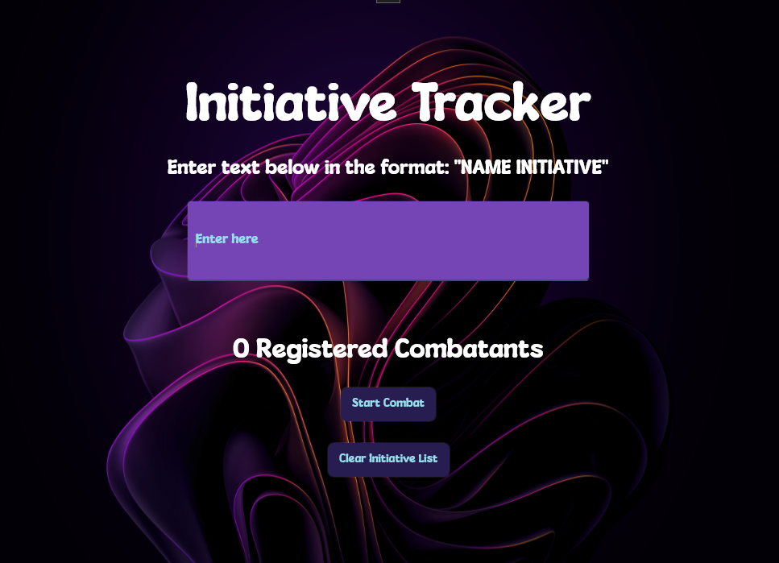
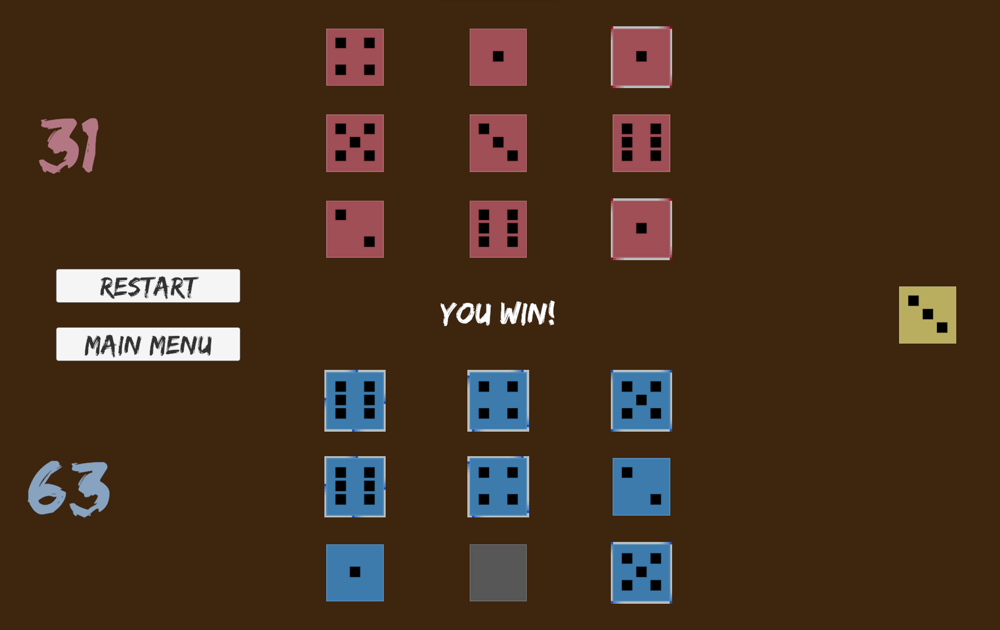
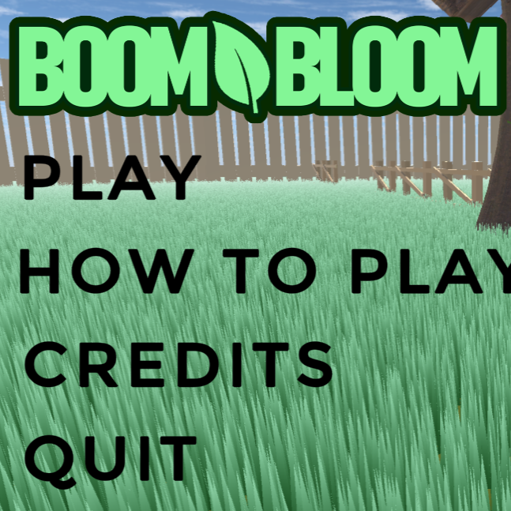
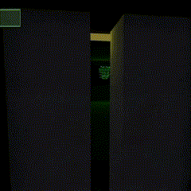
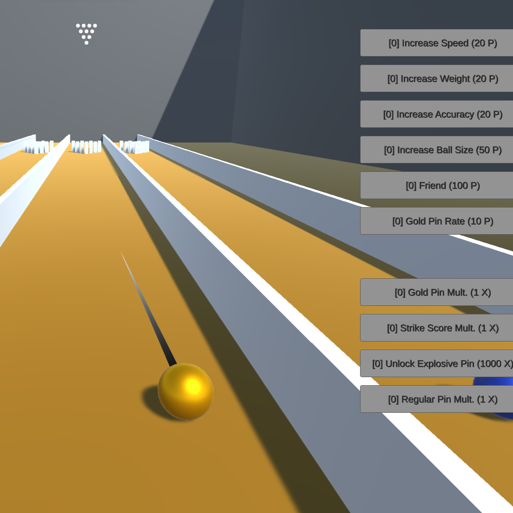

<html lang="en">
    <body>
        <!---->
        <h2>📖 Personal 📖</h2>
        
Hey, I'm Peyton Crua, a Computer Science major at the University of Utah set to graduate in 2026. Currently I'm into game development, software development, graphics, AI.

        <!---->
        <h2>💻 Current Projects 💻</h2>
        <ul>
            <li>An incremental bowling game using Unity</li>
            <li>A TTRPG Campaign manager for my Capstone (hosted on AWS and Firebase)</li>
        </ul>
        <!---->
        <h2>🕒 Future Plans 🕒</h2>
        <ul>
            <li>A website</li>
        </ul>
        <!---->
        <h2>🖥️ Work Experience 🖥️</h2>
        <ul>
            <li>Software Intern at AgileBlue, where I contributed to the development of a distributed error loging and AI integration system</li>
        </ul>
        <!---->
        <h2>🖋️ Portfolio 🖋️</h2>
        <ul>
            <li>Lead programmer for a game called <a href="https://rulyguy.itch.io/boom-and-bloom">Boom and Bloom</a></li>
            <li>Lead programmer for a game called <a href="https://stickguy101.itch.io/disquietude">Disquietude</a></li>
            <li>Recreated <a href="https://peytonc27.itch.io/knucklebones">Knucklebones</a> from Cult of the Lamb in Unity</li>
            <li>Created a software called <a href="https://peytonc27.itch.io/floatr">Floatr</a> to help save and solve simple equations</li>
            <li>Created a simple console application that <a href="https://peytonc27.itch.io/initiative-tracker">stores initiatives for D&D</a></li>
            <li><a href="https://github.com/PeytonC27/dnd-bot">A Discord Bot</a> that stores D&D character information using TypeScript/JavaScript and MongoDB (no longer worked on)</li>
            <li>A simple <a href="https://github.com/PeytonC27/Idle-Bowling">idle bowling game</a> made in Unity</li>
            <li>A <a href="https://github.com/PeytonC27/OpenGL-Rigidbody-Simulation">rigidbody simulation</a> using OpenGL and C++</li>
            <li>The developer for a mobile app for Session Zero, a TTRPG campaign management app (Senior Capstone)</li>
        </ul>
        <!---->
        <h2>📱 Socials 📱</h2>
        <ul>
            <li>
                
<a href="https://www.linkedin.com/in/peyton-crua-93a8312a6/"></a >

            </li>
            <li>
                

 
            </li>
        </ul>
        <!---->
        <h1>My Past Work</h1>
        
        
        
        
        
        
    </body>
</html>
