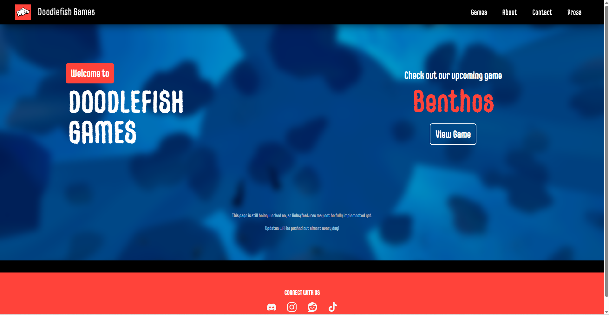
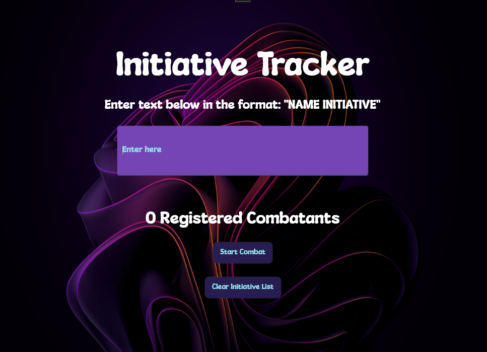
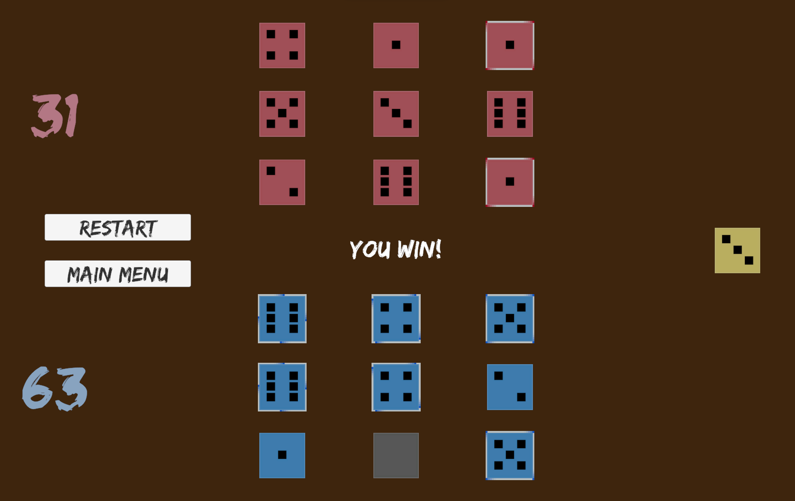
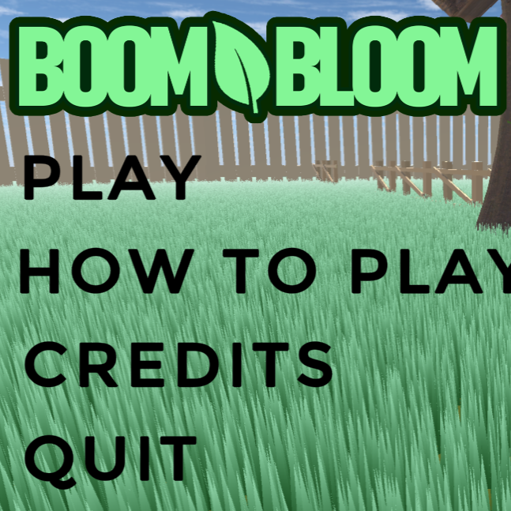
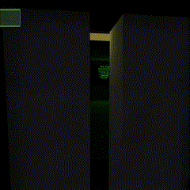
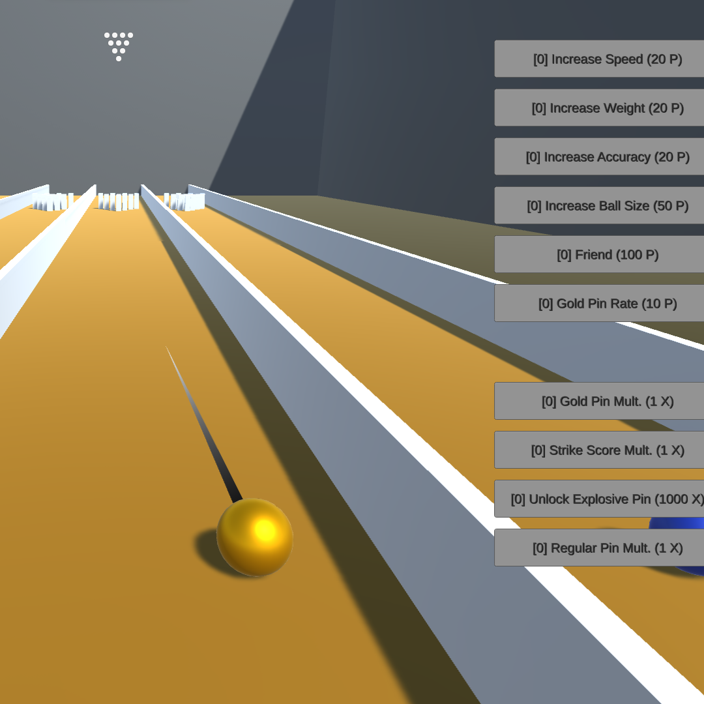

## 📖 Personal
Hey, I'm Peyton Crua, a Computer Science graduate from the University of Utah (Graduated May 2026). I'm passionate about web development, game development, and AI.

## 💻 Current Projects
* **FloatEQ**: Developing and deploying free-to-use mathematics website, built with Typescript, React, Springboot, Firebase, and Render.
* **Doodlefish Games Website:** In development, using Django and Cloudflare Pages.
* **TTRPG Campaign Manager:** I architected the REST API backend using Django to ensure seamless data flow to the **Flutter** mobile client, utilizing **AWS** for hosting and **Firebase** for real-time services.

## 🖥️ Work Experience
* **Software Intern @ AgileBlue**: Contributed to a distributed error logging and AI integration system.
* **Software Engineer @ Tata Consultancy Services**: In the process of training for ServiceNow application development, management, and configuration.

## 🛠️ Tech Stack
* **Languages:** `C#`, `Python`, `C++`, `JavaScript/TypeScript`, `Java`, `SQL (PostgreSQL)`, `HTML/CSS`
* **Frameworks/Engines:** `React`, `Springboot`, `Unity`, `.Net Core`, `Django`, `Flutter`
* **Cloud/DevOps:** `Firebase`, `MongoDB`, `AWS`, `Docker`, `Cloudflare`
* **AI Integration:** `Claude`, `Gemini`, `Prompt Engineering`
* **Tools:** `Git/GitHub`, `Jira`, `Agile Methodology`

## 🖋️ Portfolio
* Fonder: FloatEQ website. (Currently in development)
* Doodlefish Games Official Site: Website for Doodlefish Games. (Currently in development)
* Lead programmer: [Boom and Bloom](https://rulyguy.itch.io/boom-and-bloom) & [Disquietude](https://stickguy101.itch.io/disquietude)
* [Knucklebones](https://peytonc27.itch.io/knucklebones): Recreation from *Cult of the Lamb*.
* [Floatr](https://peytonc27.itch.io/floatr): Equation-saving software.
* [D&D Tools](https://github.com/PeytonC27/dnd-bot): Initiative tracker and Discord bot.
* [3D Rigidbody Simulation](https://github.com/PeytonC27/OpenGL-Rigidbody-Simulation): OpenGL-based physics.

## 📱 Socials

---

# 🕹️ Featured Work

  
   
  
  
  
   
  
  
  

