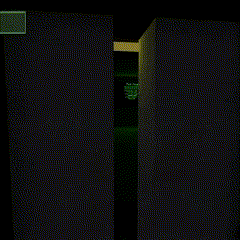

<!DOCTYPE html>
<html lang="en">
    <body>
        <h1>Personal</h1>
        
Hey, I'm Peyton Crua, a Computer Science major at the University of Utah. Currently I'm into game development, software development, and image editing.

        <h1>My Work</h1>
        <h2>Current Work</h2>
        <ul>
            <li>An esoteric programming language called Rammble</li>
            <li>An application that can turn images and videos into ASCII/text art (specifically a useable interface)</li>
            <li>Creating a video game called Invasion! (game concept by Rulon Adams)</li>
        </ul>
        <h2>Future Work</h2>
        <ul>
            <li>A more in-depth DND helper for DMs</li>
            <li>An idle game about collecting mushrooms</li>
            <li>A more advanced version of my esoteric programming language</li>
            <li>A website</li>
        </ul>
        <h1>My Past Work</h1>
        
        
        
        
    </body>
</html>
